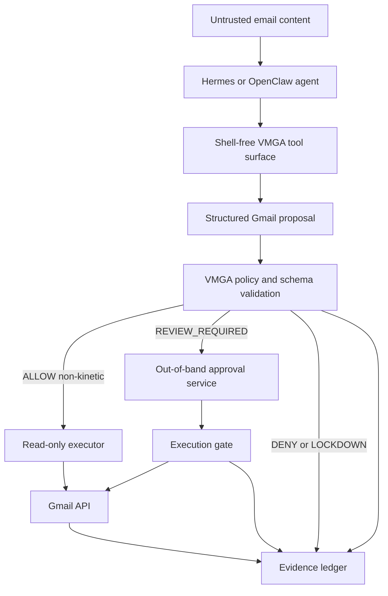
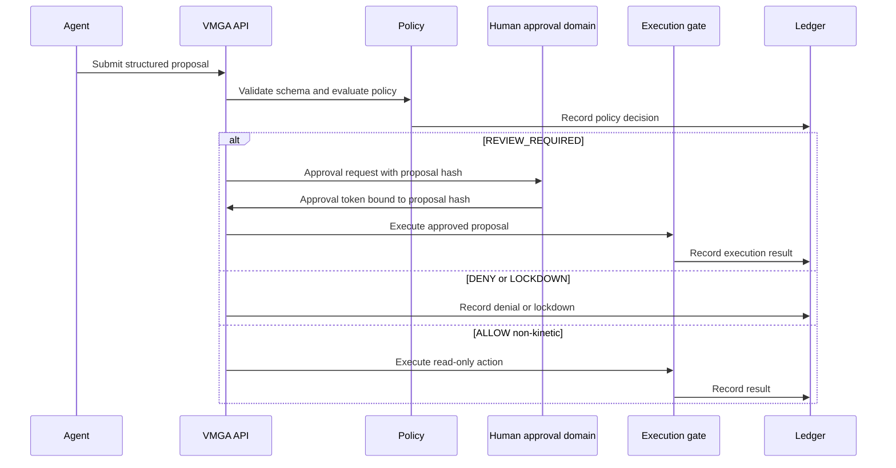

# feat: Make VMGA production-ready and open-source-ready

## Summary

This plan hardens VMGA from a TRL 4-5 Gmail governance reference into an open-source-ready component with bounded production claims. It preserves the core invariant from the VMGA specs: the agent may reason about email, but Gmail side effects must pass through a separate control plane that the agent cannot rewrite, bypass, or self-approve.

The implementation should make VMGA usable with Hermes and OpenClaw through a shared proposal, approval, execution, and evidence contract. `hardmail` should influence Hermes ergonomics and the shell-free tool surface, but VMGA should not depend on or copy its self-gated approval model.

---

## Problem Frame

The current VMGA extension already has a useful policy layer, proposal hashing, HMAC-bound approvals, state persistence, lockdown behavior, and tests in `extensions/vmga/`. Its docs still describe it as a non-production reference implementation, and several production-facing artifacts are missing or inconsistent: no isolated service boundary, no real Gmail executor boundary, no formal Hermes plugin adapter, no OpenClaw plugin manifest or example config, no VMGA-specific deployment runbook, no scoped production policy set, no packaging metadata, and no open-source contribution/security posture.

The user-provided external VMGA spec strengthens the target posture: VMGA must not be implemented only as an in-process library inside the agent runtime for hard-enforcement claims. For production mode, Gmail credentials, policy material, approval verifier secrets, executor authority, and evidence generation must live outside the agent authority domain.

`hardmail` is relevant prior art for Hermes: it demonstrates a compact shell-free native mail toolset and Hermes `platform_toolsets` scoping. Its value is the integration shape and threat framing, not its approval architecture.

---

## Requirements

- R1. VMGA must expose a production deployment shape where Gmail write authority, policy, approval verification, and ledger evidence live outside the agent runtime authority domain.
- R2. VMGA must keep an advisory/dev mode available for local testing while labeling it clearly as non-hard-enforcement when credentials or approval controls remain agent-readable.
- R3. VMGA must validate structured Gmail proposals before policy evaluation; malformed, incomplete, ambiguous, or free-form execution requests must resolve to `DENY` or `LOCKDOWN`.
- R4. VMGA must preserve exact binding between proposal, approval, and execution across recipients, attachments, target messages, action, and proposal hash.
- R5. VMGA must produce machine-readable evidence for proposal receipt, validation, policy decision, approval request, approval verification, execution attempt, execution result, denial, lockdown, and reset paths.
- R6. VMGA must support Hermes through a shell-free native mail surface inspired by `hardmail`, with kinetic actions routed through VMGA proposal and approval flow instead of direct send.
- R7. VMGA must support OpenClaw through explicit plugin/gateway artifacts that fit the existing plugin enablement and attestation patterns.
- R8. VMGA must include production policy profiles for observe-only, draft-assist, and scoped execution, with least-privilege defaults and no broad send authority by default.
- R9. VMGA must treat attachment download and release as governed actions because they write files and can become malware or exfiltration paths.
- R10. VMGA must ship open-source-ready packaging, license, security policy, contribution guidance, examples, and claim hygiene.
- R11. VMGA validation must run predictably in local and CI paths without narrowing the repository's existing core test coverage.
- R12. VMGA must include a DSOVS-aligned readiness matrix that maps release evidence to selected DevSecOps controls without implying OWASP certification.

---

## Key Technical Decisions

- **Separate service is the production target:** Production VMGA should run as an isolated service or execution component, not only as an importable Python helper inside Hermes or OpenClaw. This is required by the external VMGA spec and keeps enforcement claims aligned with `docs/deployment_runbook.md`.
- **Library mode remains advisory:** The existing in-process adapter can remain useful for tests, demos, and local development, but docs must label it as advisory unless credentials, policy, approval, and executor paths are isolated from the agent.
- **Proposal contract becomes explicit and schema-backed:** `VMGAProposal` should grow from a dataclass convention into a validated contract with versioned schema and stable denial codes. This prevents host adapters from smuggling unstructured tool arguments into the executor path.
- **Approval is out-of-band and single-use:** Keep the current HMAC binding and one-time approval semantics, but add key identifiers or verifier abstraction so production deployments can rotate secrets or replace HMAC with KMS/HSM-backed verification later.
- **Hermes borrows `hardmail` ergonomics only:** The Hermes integration should expose compact shell-free tools like search, get, attachment, draft, and send, but `send` must submit a VMGA proposal and wait on out-of-band approval rather than using Hermes self-approval.
- **OpenClaw integrates through plugin enablement:** VMGA should ship an `openclaw.plugin.json` or equivalent example plus runtime config/policy examples so OpenClaw startup can verify enablement through the existing plugin gate.
- **Evidence uses the repo's ledger idioms:** VMGA-specific event payloads should be additive but still machine-readable and compatible with the existing verifier/harness direction. New VMGA validation should avoid implying certification or compliance.
- **Open-source readiness includes claim discipline:** README, docs, and examples should say "production-ready component" only where deployment preconditions are stated. They should not claim prompt-injection prevention, DLP, host security, compliance, or hard isolation without bypass closure.
- **DSOVS is a release-readiness lens:** The OWASP DevSecOps Verification Standard should shape VMGA's release checklist, evidence expectations, and maturity language. It should not become a runtime dependency or a certification claim.

---

## High-Level Technical Design





---

## Scope Boundaries

### In Scope

- VMGA proposal schema, policy evaluation, approval binding, execution gate, state backend abstraction, ledger event coverage, and tests.
- Hermes integration artifacts that provide a shell-free email surface and route kinetic actions through VMGA.
- OpenClaw integration artifacts that follow existing plugin enablement and bypass-closure documentation patterns.
- Documentation and packaging needed for open-source adoption.
- Production claim hygiene and deployment precondition checks.

### Deferred to Follow-Up Work

- Full operator approval console UI beyond a minimal approval service/API contract.
- Hardware-backed signing, KMS, HSM, or multi-party quorum implementation.
- Multi-mailbox federation and cross-adapter identity attribution.
- Attachment sandbox or detonation beyond conservative deny/review policy and safe file handling.
- Non-Gmail providers beyond documenting how the architecture could later support IMAP/SMTP/Resend.

### Out of Scope

- Host OS sandboxing, shell containment, browser session isolation, DLP, endpoint compromise protection, and model-internal prompt-injection prevention.
- Claims that VMGA secures Hermes or OpenClaw internals.
- Importing `hardmail` wholesale as the VMGA foundation.

---

## Output Structure

The exact layout can shift during implementation, but the plan expects VMGA to move from one large adapter file toward a small package with clear boundaries.

```text
extensions/vmga/
  api/
  approval/
  executor/
  hermes/
  openclaw/
  policies/
  schemas/
  state/
  docs/
  tests/
```

---

## Implementation Units

### U1. Define the VMGA contract and package boundaries

- **Goal:** Turn the current reference adapter into a versioned VMGA package surface with explicit contracts for proposals, policy decisions, approval records, execution results, and ledger events.
- **Requirements:** R1, R2, R3, R4, R5, R10
- **Dependencies:** None
- **Files:** `extensions/vmga/vmga_adapter.py`, `extensions/vmga/__init__.py`, `extensions/vmga/schemas/`, `extensions/vmga/docs/vmga_spec_v0.2.md`, `extensions/vmga/tests/test_vmga_adapter.py`, `extensions/vmga/tests/test_vmga_contract.py`
- **Approach:** Split contract objects and validation from execution logic without changing behavior first. Add a proposal schema that includes the fields from the external VMGA spec where they materially affect execution: target messages, requested identity, profile, risk level, approval requirement, TTL, recipients, and attachment IDs. Keep backward-compatible constructor helpers if existing tests depend on the current dataclass shape.
- **Execution note:** Start with characterization tests around the current proposal hash and approval binding behavior before moving contract code.
- **Patterns to follow:** `core/models.py` for canonical envelope style, `docs/governance_gateway_contract.md` for contract language, and existing `VMGAProposal.compute_hash()` determinism.
- **Test scenarios:**
  - Creating the same proposal with reordered recipients, message IDs, or attachment IDs produces the same canonical hash.
  - A proposal missing required production fields is denied with a stable VMGA schema error code before policy evaluation.
  - A legacy/simple proposal path used by existing tests still maps into the versioned proposal object.
  - An unknown action string is denied with `vmga_invalid_action`.
  - Proposal TTL expiration prevents approval or execution.
- **Verification:** VMGA contract tests prove schema validation happens before policy evaluation and hash semantics remain deterministic.

### U2. Isolate production state and approval verification

- **Goal:** Replace production reliance on JSON state files with a state backend abstraction and a durable SQLite/WAL implementation while retaining the current JSON store for dev and tests.
- **Requirements:** R1, R2, R4, R5, R8
- **Dependencies:** U1
- **Files:** `extensions/vmga/vmga_adapter.py`, `extensions/vmga/state/`, `extensions/vmga/approval/`, `extensions/vmga/tests/test_vmga_state.py`, `extensions/vmga/tests/test_vmga_approval.py`
- **Approach:** Introduce a `VMGAStateStore` protocol with JSON and SQLite implementations. Approval verification should move behind a verifier interface that supports current HMAC tokens and leaves a clean path for key IDs and rotation. Production config should default to strict mode and fail-closed corrupted state behavior.
- **Patterns to follow:** Current atomic JSON write semantics in `VMGAStateStore`, current rate-limit persistence tests, and the fail-closed posture in `core/fail_closed.py`.
- **Test scenarios:**
  - SQLite state persists pending proposals, approvals, used flags, denial counts, lockdown state, and failed token attempts across adapter restarts.
  - Concurrent approval attempts for the same proposal cannot produce two successful executions.
  - Approval with a wrong token is denied and increments persistent rate-limit state.
  - A used approval remains used after restart and cannot replay.
  - Corrupted or unavailable production state backend triggers `LOCKDOWN` or stable denial according to config.
- **Verification:** Both JSON dev store and SQLite production store pass the shared state behavior suite.

### U3. Build the VMGA execution gate and Gmail executor boundary

- **Goal:** Create an executor layer where only VMGA-controlled code can perform Gmail side effects, and all kinetic execution verifies proposal and approval invariants immediately before action.
- **Requirements:** R1, R3, R4, R5, R8, R9
- **Dependencies:** U1, U2
- **Files:** `extensions/vmga/executor/`, `extensions/vmga/policies/`, `extensions/vmga/tests/test_vmga_executor.py`, `extensions/vmga/tests/test_vmga_policy.py`
- **Approach:** Separate read-only execution from kinetic execution. The gate should verify proposal hash, approval token, approver identity, TTL, recipients, attachment IDs, target message IDs, action class, and profile before calling Gmail. Attachments should be deny/review by default and written only to controlled paths when allowed.
- **Patterns to follow:** Current `execute_approved()` binding checks and `VMGAPolicy.evaluate()` deny-by-default behavior.
- **Test scenarios:**
  - Mutating recipients, attachments, target messages, action, or body after approval denies execution.
  - `create_draft` can execute only after a valid approval when profile requires review.
  - `send` is denied by default in observe-only and draft-assist profiles.
  - Attachment download from unknown sender requires review or denies according to policy.
  - Gmail executor failure records an execution error event without marking approval used when no side effect occurred.
  - Successful kinetic execution marks approval used only after durable state write.
- **Verification:** Executor tests prove no Gmail side-effect function is reachable without the VMGA gate checks.

### U4. Normalize VMGA evidence events and validation

- **Goal:** Make VMGA evidence complete, machine-readable, and compatible with repository verifier expectations.
- **Requirements:** R5, R10, R11
- **Dependencies:** U1, U2, U3
- **Files:** `extensions/vmga/ledger/`, `extensions/vmga/tests/test_vmga_evidence.py`, `benchmarks/schemas/`, `scripts/verify_evidence_bundle.py`, `docs/evidence_retention_notes.md`
- **Approach:** Add VMGA event builders for proposal receipt, validation, policy decision, approval requested, approval verified, execution attempted, execution succeeded, execution denied, lockdown triggered, and manual reset. Either extend the existing ledger schema additively or add a VMGA-specific evidence schema referenced from bundle verification. Keep denials stable with `error_code` and `rule_id`.
- **Patterns to follow:** `benchmarks/schemas/governance_ledger_entry_v0.1.schema.json`, `docs/adapter_template.md`, and existing audit ledger append patterns.
- **Test scenarios:**
  - Every `REVIEW_REQUIRED` proposal emits proposal, validation, policy, and approval-request evidence.
  - Every approval success emits approval verification evidence with token hash only, never raw token.
  - Every denied approval or execution emits machine-readable `error_code` and VMGA `rule_id`.
  - Lockdown and manual reset events include actor/admin identity and reason fields.
  - Bundle verification accepts VMGA evidence or emits a clear actionable error when required VMGA events are missing.
- **Verification:** A VMGA evidence fixture can be generated and validated without relying on informal README examples.

### U5. Add Hermes integration inspired by hardmail

- **Goal:** Ship a Hermes-compatible shell-free VMGA mail surface that uses structured tool calls and routes kinetic actions through VMGA.
- **Requirements:** R2, R6, R9, R10
- **Dependencies:** U1, U3, U4
- **Files:** `extensions/vmga/hermes/`, `extensions/vmga/docs/hermes_integration.md`, `extensions/vmga/tests/test_vmga_hermes.py`, `examples/vmga/hermes_config.yaml`
- **Approach:** Define Hermes tools in the spirit of `hardmail`: search, get, attachment, draft, and send. Read-only tools may return data through VMGA policy, while `create_draft`, `send`, `forward`, label, archive, delete, and attachment release submit proposals. Document `platform_toolsets` scoping so email-capable surfaces do not need `terminal`, browser, or generic web tools.
- **Patterns to follow:** `hardmail` tool vocabulary and `plugin.yaml` ergonomics as prior art; VMGA approval and execution gate for enforcement.
- **Test scenarios:**
  - Hermes `mail_search` maps to VMGA non-kinetic read action and records evidence.
  - Hermes `mail_send` returns `REVIEW_REQUIRED` or `DENY` rather than sending directly.
  - Hermes attachment request maps to governed attachment action and respects policy.
  - Missing VMGA service or approval channel fails closed for kinetic actions.
  - Hermes config examples do not place Gmail tokens or VMGA secrets in agent-readable plugin files.
- **Verification:** A local mock Hermes tool call can exercise VMGA without requiring a shell tool or live Gmail credentials.

### U6. Add OpenClaw plugin and gateway integration

- **Goal:** Make VMGA usable through OpenClaw's plugin/gateway model with explicit enablement and documented bypass-closure requirements.
- **Requirements:** R1, R5, R7, R10, R11
- **Dependencies:** U1, U3, U4
- **Files:** `extensions/vmga/openclaw/`, `extensions/vmga/openclaw/openclaw.plugin.json`, `extensions/vmga/docs/openclaw_integration.md`, `examples/vmga/openclaw_gateway_config.yaml`, `tests/test_profile_adapter.py`, `extensions/vmga/tests/test_vmga_openclaw.py`
- **Approach:** Provide a plugin manifest and example runtime config that map Gmail actions into `ExecutionRequestEnvelope` fields with `plugin_id` and `tool_id` values that the existing plugin gate can attest. Keep OpenClaw claims bounded to the adapter/gateway boundary and reference bypass-closure deployment controls.
- **Patterns to follow:** `examples/openclaw_gateway_config.yaml`, `profiles/openclaw/INTEGRATION_STATUS.md`, `docs/bypass_closure/openclaw.md`, and `benchmarks/harness/common.py` plugin fixture shape.
- **Test scenarios:**
  - OpenClaw startup denies VMGA plugin enablement when manifest hash or attestation is missing.
  - A governed VMGA request includes stable `plugin_id`, `tool_id`, `actor_id`, and metadata.
  - Missing plugin enablement prevents VMGA execution through OpenClaw.
  - OpenClaw integration docs distinguish adapter conformance from deployment assurance.
- **Verification:** OpenClaw example config and plugin manifest can be used in a fixture that passes existing plugin gate checks.

### U7. Harden policy profiles and production configuration

- **Goal:** Provide production-ready policy examples with least-privilege defaults and clear profile semantics.
- **Requirements:** R2, R3, R8, R9, R10
- **Dependencies:** U1, U3
- **Files:** `extensions/vmga/policies/observe_only.yaml`, `extensions/vmga/policies/draft_assist.yaml`, `extensions/vmga/policies/scoped_execution.yaml`, `extensions/vmga/schemas/policy.schema.json`, `extensions/vmga/tests/test_vmga_policy_profiles.py`, `extensions/vmga/docs/policy_profiles.md`
- **Approach:** Add missing `scoped_execution.yaml`, validate policy files against a schema, and remove environment-specific domains from default policies in favor of examples. Keep `send`, `forward`, `delete`, and attachment release denied or review-required by default.
- **Patterns to follow:** `docs/policy_schema_v0.1.2.md` strictness and current profile examples in `extensions/vmga/policies/`.
- **Test scenarios:**
  - All shipped policy profiles validate against VMGA policy schema.
  - Unknown policy keys fail validation in production strict mode.
  - Observe-only allows only non-kinetic actions.
  - Draft-assist allows draft proposal flow but denies send.
  - Scoped execution permits only configured labels/archive rules and denies unknown labels.
  - Default policies contain placeholder domains only where clearly marked as examples.
- **Verification:** Policy profile tests prove each shipped YAML file has deterministic allow/review/deny outcomes.

### U8. Add deployment runbooks, threat model, and open-source docs

- **Goal:** Make VMGA understandable and safe to adopt by outside users without overstating security claims.
- **Requirements:** R1, R2, R6, R7, R9, R10
- **Dependencies:** U1, U5, U6, U7
- **Files:** `extensions/vmga/README.md`, `extensions/vmga/docs/deployment_runbook.md`, `extensions/vmga/docs/threat_model.md`, `extensions/vmga/docs/hermes_integration.md`, `extensions/vmga/docs/openclaw_integration.md`, `extensions/vmga/docs/security.md`, `extensions/vmga/docs/release_checklist.md`, `README.md`
- **Approach:** Rewrite VMGA docs around three modes: dev/advisory library mode, isolated service mode, and deployment-verified hard-enforcement mode. Include Hermes and OpenClaw setup examples, bypass-closure checklists, secret isolation guidance, attachment risk guidance, and "what VMGA does not claim." Acknowledge `hardmail` as prior art for shell-free Hermes mail tooling if code or specific concepts are borrowed.
- **Patterns to follow:** `docs/reviewer_guide.md`, `docs/deployment_runbook.md`, `docs/limitations.md`, and `README.md` claim discipline.
- **Test scenarios:**
  - Documentation examples reference existing files and valid policy names.
  - Production checklist includes credential isolation, policy immutability, approval isolation, state isolation, and evidence durability.
  - Docs label in-process mode as advisory when deployment preconditions are absent.
  - README does not claim prompt-injection prevention, DLP, certification, host security, or OpenClaw/Hermes internals enforcement.
- **Verification:** A reviewer can follow VMGA docs from install through mock approval flow without finding broken paths or overstated claims.

### U9. Prepare packaging, licensing, and CI for open source

- **Goal:** Make VMGA installable, testable, and maintainable as an open-source component inside or alongside the repo.
- **Requirements:** R10, R11, R12
- **Dependencies:** U1, U5, U6, U7, U8
- **Files:** `pyproject.toml`, `requirements.txt`, `requirements-dev.txt`, `pytest.ini`, `scripts/check.sh`, `.github/workflows/bench.yml`, `extensions/vmga/LICENSE_NOTICES.md`, `extensions/vmga/SECURITY.md`, `extensions/vmga/CONTRIBUTING.md`, `extensions/vmga/CHANGELOG.md`
- **Approach:** Add packaging metadata only if the repository intends VMGA to be pip-installable; otherwise add a documented package extra or install path. Fix `pytest.ini` so the full repository test suite is not accidentally narrowed to VMGA. Add VMGA compile/test coverage to `scripts/check.sh` and CI. Include license notices if any MIT prior-art code from `hardmail` is adapted. Add DSOVS-inspired CI checks for secrets, SAST, dependency/SCA, license compliance, and secure dependency management where they fit the Python package.
- **Patterns to follow:** Existing `.github/workflows/bench.yml`, `scripts/check.sh`, and repository README test commands.
- **Test scenarios:**
  - `pytest -q` runs the intended full suite or an explicitly documented selected suite.
  - `./scripts/check.sh` compiles VMGA code and runs VMGA tests.
  - Packaging metadata includes all VMGA package files and policy/docs assets needed at runtime.
  - Security and contribution docs exist and avoid unsupported response guarantees.
  - License notices correctly attribute borrowed MIT material if any code is copied.
- **Verification:** A fresh checkout can install dependencies, run checks, import VMGA, and produce CI evidence for the selected DSOVS code/build controls.

### U10. Add DSOVS-aligned readiness assessment

- **Goal:** Provide a lightweight VMGA release-readiness matrix using selected OWASP DSOVS controls as an external benchmark for secure open-source delivery.
- **Requirements:** R10, R11, R12
- **Dependencies:** U4, U8, U9
- **Files:** `extensions/vmga/docs/dsovs_readiness.md`, `extensions/vmga/docs/release_checklist.md`, `extensions/vmga/tests/test_vmga_docs.py`
- **Approach:** Map VMGA release evidence to DSOVS controls that directly apply: `DSOVS-DES-002` threat modelling, `DSOVS-CODE-002` hardcoded secrets detection, `DSOVS-CODE-004` SAST, `DSOVS-CODE-005` SCA, `DSOVS-CODE-006` license compliance, `DSOVS-CODE-008` container scanning if containers are shipped, `DSOVS-CODE-009` secure dependency management, `DSOVS-REL-001` artifact signing if releases are published, `DSOVS-REL-002` secure artifact management, `DSOVS-REL-003` secret management, `DSOVS-REL-004` secure configuration, `DSOVS-REL-005` security policy enforcement, `DSOVS-REL-006` IaC secure deployment if deployment templates are shipped, `DSOVS-REL-008` secure release management, `DSOVS-OPR-004` application security logging, `DSOVS-OPR-005` vulnerability disclosure, and `DSOVS-TEST-005` security test coverage. Use DSOVS maturity levels as internal readiness language only.
- **Patterns to follow:** DSOVS uses stable control IDs, machine-readable YAML source of truth, four maturity levels, and concrete verification evidence. Mirror that evidence-oriented style without importing DSOVS data into VMGA.
- **Test scenarios:**
  - Readiness doc references selected DSOVS control IDs and states what VMGA evidence satisfies each one.
  - Readiness doc explicitly says the mapping is self-assessment guidance, not OWASP certification or endorsement.
  - Release checklist fails review if required evidence for secrets scanning, SAST, dependency review, license review, vulnerability disclosure, and security test coverage is absent.
  - Docs test verifies all DSOVS links point to public control docs or the DSOVS project, not local `/tmp` review paths.
- **Verification:** The readiness matrix gives reviewers concrete evidence to check for each selected DSOVS control and clearly labels the mapping as self-assessment guidance.

---

## System-Wide Impact

VMGA production readiness crosses core governance contracts, host adapter integration, docs, CI, and public repository posture. The most important system impact is claim clarity: VMGA can be a production-ready governance component, but enforcement depends on deployment controls that keep agents away from Gmail credentials, approval secrets, policy files, executor authority, and direct Gmail egress.

Hermes users get a safer email capability surface by avoiding shell-backed mail workflows. OpenClaw users get a plugin/gateway path that fits the repository's existing adapter pattern. Reviewers get concrete files, schemas, tests, and runbooks instead of broad claims.

---

## Risks & Dependencies

- **Hermes API drift:** Hermes plugin APIs and repository naming may drift. Mitigation: keep Hermes integration thin, documented, and tested with local mocks; treat direct Hermes runtime verification as an implementation-time task.
- **OpenClaw plugin contract drift:** Public OpenClaw plugin docs may not match this repo's reference adapter exactly. Mitigation: target the local OpenClaw plugin gate first and keep external OpenClaw docs as non-authoritative context.
- **Production claims can overreach:** Email governance language can accidentally imply prompt-injection prevention or host security. Mitigation: docs must preserve the deployment preconditions and non-goals from `docs/deployment_runbook.md` and the external VMGA spec.
- **SQLite is not horizontal HA:** SQLite/WAL is a strong single-node production baseline but not multi-instance coordination. Mitigation: document Redis or managed DB rate-limit/state as follow-up for HA.
- **Attachment handling is deceptively risky:** Attachment download looks read-only but writes files. Mitigation: treat it as governed, deny/review by default, and constrain output paths.
- **`hardmail` license obligations:** MIT permits reuse, but copied code requires attribution. Mitigation: prefer conceptual borrowing; add `LICENSE_NOTICES.md` if implementation copies code.
- **DSOVS mapping can be mistaken for certification:** Referencing OWASP DSOVS may read like endorsement. Mitigation: every DSOVS mention should say it is a self-assessment/readiness mapping and not an OWASP certification claim.

---

## Documentation And Operational Notes

VMGA docs should include:

- A quickstart for mock/local mode with no production claims.
- A production deployment runbook with Linux-oriented checks for process separation, secret isolation, policy immutability, state path permissions, and egress restriction.
- A Hermes integration guide that explains shell-free tool scoping and why VMGA differs from self-gated send approval.
- An OpenClaw integration guide that explains plugin enablement, attestation, and bypass closure.
- A security policy for reporting vulnerabilities.
- A release checklist that verifies claim hygiene, test coverage, packaging, license notices, and DSOVS-aligned release evidence.

---

## Sources And Research

- `extensions/vmga/README.md` and `extensions/vmga/docs/vmga_spec_v0.2.md` define the current VMGA reference posture, profiles, production checklist, and future work.
- `extensions/vmga/vmga_adapter.py` and `extensions/vmga/tests/test_vmga_adapter.py` show existing implementation coverage for proposal hashing, HMAC approvals, lockdown, TTL, state persistence, and rate limiting.
- `docs/adapter_template.md`, `docs/adapter_integration_contract.md`, `docs/deployment_runbook.md`, and `docs/bypass_closure/openclaw.md` define the repo's bounded adapter and bypass-closure claims.
- `examples/openclaw_gateway_config.yaml`, `openclaw/profile_adapter.py`, and `core/adapter_interface.py` define the local OpenClaw integration style.
- The user-provided external VMGA spec adds production requirements around separate authority domains, process boundary, structured proposal-only API, exact proposal/approval/execution binding, required evidence event types, and Hermes/OpenClaw deployment constraints.
- `orlyjamie/hardmail` at commit `0fd3c5f` provides MIT-licensed prior art for a compact Hermes shell-free email plugin. It should influence VMGA's Hermes tool ergonomics and platform toolset scoping, not VMGA's approval or credential-boundary model.
- OWASP DevSecOps Verification Standard at commit `68d55be` provides an external readiness framework with stable control IDs, maturity levels, and verification evidence. VMGA should use it to shape release evidence around threat modelling, SAST, SCA, secrets, license compliance, dependency management, artifact/release handling, secure configuration, logging, vulnerability disclosure, and security test coverage.
- Public Hermes materials show `google-workspace` as a Hermes skill surface that uses Google OAuth and can be replaced or wrapped by a VMGA-controlled mail surface.
- Public OpenClaw plugin docs support the plugin/gateway framing, while this repo's local OpenClaw adapter remains the authoritative implementation target.
